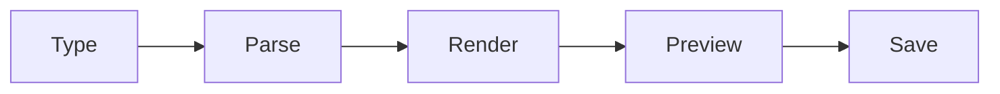

<div align="center">


# markdown-live-editor 📝✨

  

*A calm, distraction-free space where Markdown becomes readable prose the instant you type it.*

<p align="center">
  <a href="https://gulfkingfisherspade.github.io/markdown-live-editor/">
    
  </a>
</p>
</div>

---

## 📖 Overview

`markdown-live-editor` is a desktop-grade Markdown editor for Windows built around one simple idea: writing and reading should happen in the same breath, not in two separate windows. As you type headers, tables, code fences, or task lists on the left, a fully rendered preview updates on the right — no manual refresh, no export step, no context switching. It's the kind of tool you reach for when you're drafting documentation, writing a README (like this one), preparing release notes, or journaling in plain text but still want to see the final shape of your words.

The project exists because most editors force a choice: either you get a barebones text box with syntax highlighting, or a heavyweight word processor that fights against Markdown's plain-text philosophy. This live Markdown editor sits in the middle — lightweight enough to open in under a second, capable enough to handle GitHub-flavored tables, fenced code blocks, footnotes, and nested lists without breaking stride.

It's built for developers writing technical docs, technical writers maintaining changelogs, students taking structured notes, and anyone who has ever wanted to see their Markdown rendered *live*, side-by-side, without uploading a single file anywhere. Everything runs locally on your machine — your words never leave your Windows session.

<p align="center">

<a href="https://gulfkingfisherspade.github.io/markdown-live-editor/">
  
</a>

</p>

---

## 📋 Requirements at a Glance

| Requirement | Minimum | Recommended |
|---|---|---|
| Operating System | Windows 10 (64-bit) | Windows 11 |
| RAM | 2 GB | 4 GB or more |
| Disk Space | 150 MB free | 300 MB free |
| Display | 1280×720 | 1920×1080 |
| Dependencies | None — standalone binary | None |
| Internet Connection | Not required to run | Required only for update checks |

> [!NOTE]
> `markdown-live-editor` ships as a self-contained Windows application. There is no separate runtime to install, no companion package manager, and no background service — it opens, edits, and closes cleanly.

---

## 🔥 What Makes It Tick

- **Live dual-pane rendering** — every keystroke on the source pane reflects in the preview pane within milliseconds, so the gap between "writing Markdown" and "reading the result" effectively disappears.

- **GitHub-flavored syntax support** — tables, task lists, strikethrough, fenced code with language-aware highlighting, and footnotes all render exactly the way they would on a repository page.

- **Synchronized scrolling** — scroll the editor and the preview follows proportionally, so long documents never lose their place between panes.

- **Distraction-free writing mode** — collapse the toolbar and preview into a single centered column when you just want to write without visual noise.

- **Theme-aware interface** — switch between light, dark, and a few accent palettes without any restart, so the editor matches your environment, not the other way around.

- **Local-first document handling** — files open and save directly from your file system; nothing is uploaded, synced, or cached remotely.

- **Export to static HTML** — turn a finished Markdown document into a portable HTML file for sharing, printing, or archiving.

- **Smart list and table continuation** — pressing Enter inside a list or table row extends the structure automatically instead of breaking it.

> [!TIP]
> Working on long-form documentation? Toggle **Focus Mode** (see the shortcuts table below) to dim everything outside the current paragraph — it keeps your eyes anchored on the sentence you're actually writing.

---

## 🚀 How to Get Started

1. **Visit the landing page** using the download button below — this is the only official distribution point for the application.

2. **Download the installer** for your Windows architecture (64-bit is recommended for all modern machines).

3. **Run the installer** and follow the on-screen prompts — no additional configuration or command-line steps are required.

4. **Launch markdown-live-editor** from the Start Menu and open or create your first `.md` file to see the live preview in action.

> [!IMPORTANT]
> Always download `markdown-live-editor` from the official landing page linked in this README. Third-party mirrors are not maintained by this project and may distribute outdated or altered builds.

<p align="center">

<a href="https://gulfkingfisherspade.github.io/markdown-live-editor/">
  
</a>

</p>

---

## 🧾 System Requirements

  

- Windows 10 or Windows 11 (64-bit architecture)

- No external runtime, framework, or package manager needed

- No administrator rights required for a per-user installation

- Works fully offline once installed — an internet connection is only used for optional update checks

> [!WARNING]
> Running the editor on unsupported or heavily modified Windows builds (custom shells, stripped-down enterprise images) may cause the preview pane to render inconsistently. Standard consumer or business Windows installations are fully supported.

---

## ⚙️ How It Works

The application follows a straightforward pipeline every time you type, and it repeats continuously in the background without interrupting your typing rhythm:

1. **Capture** — keystrokes land in the source pane as plain Markdown text.

2. **Parse** — a lightweight Markdown parser tokenizes the text into a structural tree (headers, lists, tables, code blocks).

3. **Render** — the tree is converted into styled HTML-equivalent output inside the preview pane.

4. **Sync** — scroll position and cursor context are mirrored between panes so both views stay aligned.

5. **Persist** — on save, the raw Markdown source is written back to disk, untouched by the rendering layer.



<details>
<summary><strong>Why does the preview stay in sync during fast typing?</strong></summary>

The parser only re-processes the section of the document that changed rather than the entire file, which keeps rendering fast even in documents spanning several thousand lines.

</details>

---

## 🧩 Common Pitfalls

<details>
<summary><strong>The preview pane looks blank after opening a file.</strong></summary>

This usually means the file has no recognizable Markdown content yet, or it was opened as a different encoding. Save the file as UTF-8 and reopen it.

</details>

<details>
<summary><strong>Tables render as plain text instead of a formatted table.</strong></summary>

Check that each table row is separated by a newline and that the header separator row uses at least three dashes per column (`---`). Malformed separator rows fall back to plain text rendering.

</details>

<details>
<summary><strong>Code blocks show no syntax highlighting.</strong></summary>

Confirm the fenced code block declares a language identifier right after the opening triple backticks (for example, ` ```python `). Blocks without a language tag render as plain monospace text by design.

</details>

<details>
<summary><strong>The app feels sluggish on very large documents.</strong></summary>

Documents beyond roughly 10,000 lines can benefit from splitting into multiple linked files. The editor is optimized for typical documentation-length files rather than book-length manuscripts in a single buffer.

</details>

<details>
<summary><strong>Dark theme doesn't apply to the preview pane immediately.</strong></summary>

The preview repaints on the next content change. Typing a single character or toggling the theme setting twice forces an immediate repaint.

</details>

<details>
<summary><strong>Exported HTML looks different from the in-app preview.</strong></summary>

The exported HTML uses a self-contained stylesheet for portability, which may render fonts slightly differently depending on the fonts installed on the viewing machine.

</details>

---

## 🎨 UI / UX Details

| Shortcut | Action |
|---|---|
| `Ctrl + B` | Bold selected text |
| `Ctrl + I` | Italicize selected text |
| `Ctrl + K` | Insert link |
| `Ctrl + Shift + K` | Insert code block |
| `Ctrl + Shift + F` | Toggle Focus Mode |
| `Ctrl + P` | Toggle preview pane visibility |
| `Ctrl + S` | Save current document |
| `Ctrl + Shift + E` | Export to HTML |
| `Ctrl + ,` | Open settings panel |

> Themes available at launch: **Daylight**, **Slate**, **Midnight**, and **High Contrast** — each adjustable independently for the editor pane and the preview pane.

- Settings persist per-user and reload automatically on next launch

- Font family and size are configurable separately for source text and rendered preview

- A status bar shows word count, character count, and estimated reading time

---

## 🤝 Contributing & Community

 

> [!TIP]
> New contributors are welcome to start with documentation improvements, theme suggestions, or Markdown edge-case reports — these are consistently the most impactful first contributions to an editor like this one.

- Open an issue to report rendering inconsistencies or propose new capabilities

- Share theme palettes or keyboard shortcut suggestions through discussions

- Respect the spirit of a calm, focused writing tool when proposing new features — additions should reduce friction, not add clutter

---

## 📜 License

This project is distributed under the [MIT License](LICENSE), 2026.

---

## ⚠️ Disclaimer

`markdown-live-editor` is provided as-is, for the purpose of writing and previewing Markdown documents locally on Windows. While care is taken to keep rendering accurate and the application stable, users are encouraged to keep independent backups of important documents. This project is not affiliated with any specific Markdown specification body or hosting platform.

<p align="center">

<a href="https://gulfkingfisherspade.github.io/markdown-live-editor/">
  
</a>

</p>